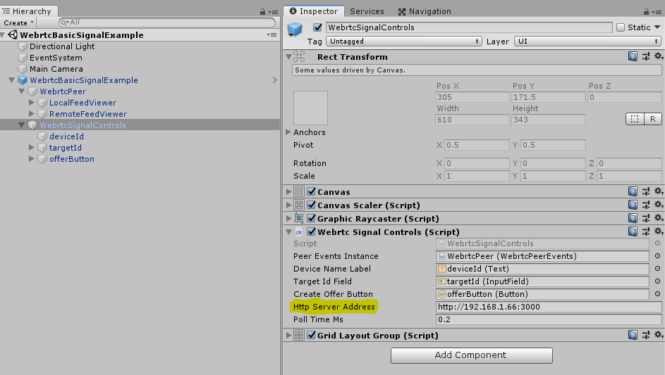
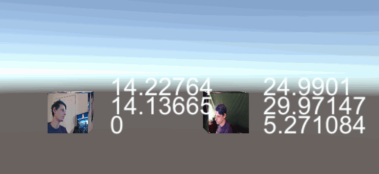
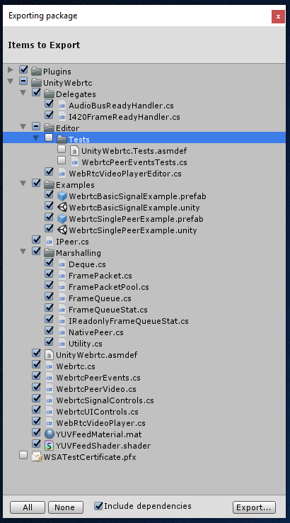

# Webrtc Unity Plugin

> Work in progress (Alpha Status)

Cross-platform Webrtc support for Unity apps ☁🎲

## Why

We needed a cross-platform webrtc solution for Unity, based on [webrtc's unityplugin example](https://webrtc.googlesource.com/src/+/refs/heads/master/examples/unityplugin/) that supports `win32`, `winuwp`, and `android` (theoretically linux and mac are supported as well, but untested). The ✨ magic ✨ of this repository is threefold:

1) We support a [winuwp](https://github.com/webrtc-uwp) (hololens compatible) binary
2) We include a [sample signalling](https://github.com/bengreenier/node-dss) implementation
3) We provide a working end-to-end example

## How to use

> Officially supports Unity 2017.4.x (LTS) and Unity 2018.3.x

+ Import [the latest release package](https://github.com/bengreenier/webrtc-unity-plugin/releases/latest)
+ Take a look at the `UnityWebrtc\Examples` directory
+ Run an example to ensure your a/v hardware is working
+ A [detailed walkthrough](https://github.com/bengreenier/webrtc-unity-plugin/issues/1) describing the managed components is coming soon

### Webrtc Basic Signal Example

The basic signal example (`WebrtcBasicSignalExample.unity`) is designed to quickly demonstrate what managed code we'd need to write to configure a peer instance using a service to exchange sdp information (handshake) and ice candidates (NAT traversal).

To use it, one needs to set up a few dependencies:

+ Clone, setup, and run an instance of [node-dss](https://github.com/bengreenier/node-dss#how) (instructions at link).
+ Modify the `WebrtcSignalControls` script via the inspector, on the `WebrtcSignalControls` object to point at your `node-dss` server url.

Once the server is running and Unity is configured, both clients should be able to exchange information by device id. The device id is displayed across the top left of the screen, and should be typed into the remote peers input field.

For instance, to connect Peer A (device id: 1) with Peer B (device id: 2) the `targetId` input field for Peer A should have the value `2`. For Peer B, it should have the value `1`. A connection can not succeed unless __both peers have the input field populated__.

Once the `targetId` field is filled on both peers, either peer can begin the connection by clicking the `offerButton`.

At this point, sdp messages (handshake data) and ice candidates (NAT traversal data) should be sent via the server, and the clients should be able to connect successfully.

### Reference Docs

To better understand the API space of this solution, take a look at [the hosted API docs](https://bengreenier.github.io/webrtc-unity-plugin).

For more information, check out [the brief overview video](https://youtu.be/n3eefDynisk).

### Running

In editor, `Win32` is supported - this means if you're on Windows and you hit "Play" in the Unity Editor, your application should just work. For other platforms, one must produce a Unity Player build in order to fully test.

## Contributing

No contributing guidelines at this time. However, to produce a new `unitypackage` when a new Release is needed, one must use Unity and select these fields:

## License

MIT
